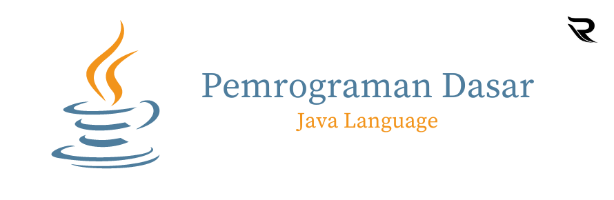

Pemrograman Java adalah bahasa pemrograman tingkat tinggi yang dikembangkan oleh Sun Microsystems (sekarang dimiliki oleh Oracle Corporation) pada tahun 1995. Java dirancang dengan prinsip "Write Once, Run Anywhere" (Tulis Sekali, Jalankan Di Mana Saja) yang mengartikan bahwa program Java dapat dijalankan di berbagai platform tanpa perlu mengubah kode sumbernya. Java populer dalam pengembangan perangkat lunak berbasis objek, dan menjadi salah satu bahasa pemrograman yang paling banyak digunakan di dunia. Bahasa Java memiliki ekosistem yang kuat, termasuk perpustakaan (library) yang luas dan berbagai alat pengembangan yang mendukung berbagai jenis aplikasi.

Terdapat 5 Program diantaranya :
1. Program Converter.
2. Program Deret.
3. Program Kasir.
4. Program Plant Zombie.
5. Program Element.
6. Program IPv4ToBinner.

Credit by : Rayhan Rizky Widi Ananta - Tugas Kuliah
Tanggal Update :

31/10/2023 "Dokumentasi Pemrograman Java"

